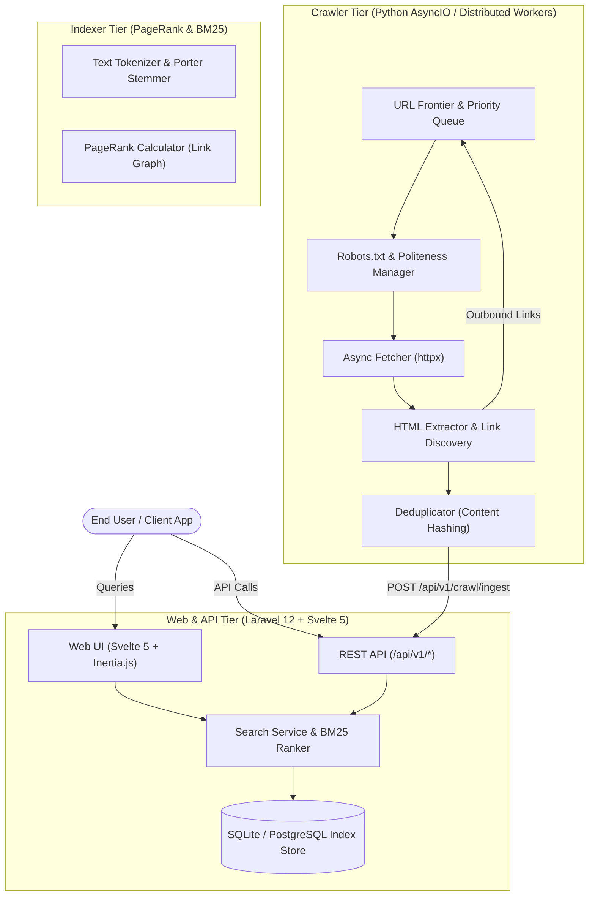

# Architecture Overview — Web-Search.org

Web-Search.org is an open-source, privacy-first, distributed search engine ecosystem. The system is designed as a modular monorepo containing distinct but interoperable services: web frontend, REST API, crawler nodes, indexing pipelines, and client SDKs.

---

## 1. System Topology & Data Flow

---

## 2. Component Descriptions

### `apps/web` (Laravel 12 + Svelte 5 + Inertia.js)
- **Search Engine UI**: Ultra-fast, minimal search experience with instant query suggestions, category filters (`all`, `tech`, `code`, `news`), instant math & conversion answers, and dark mode.
- **Crawler Dashboard**: Real-time management interface allowing administrators and users to submit URLs to be indexed, inspect crawler progress, and monitor domain health.
- **Search API**: RESTful endpoints providing programmatic query access (`/api/v1/search`, `/api/v1/suggest`, `/api/v1/stats`).
- **Storage Layer**: Eloquent models mapping `WebPage`, `Domain`, `CrawlJob`, and `SearchQuery` with indexed text fields.

### `apps/crawler` (Python 3.11+ AsyncIO)
- **High Concurrency Fetcher**: Asynchronous HTTP client built with `httpx` and connection pooling.
- **Polite Crawling**: Per-domain rate limiting and automated `robots.txt` compliance parsing.
- **Content Extractor**: Cleans HTML, strips script/style tags, extracts title, headings, meta tags, and discovers outbound links for recursive graph traversal.
- **Deduplication**: Content hashing prevents re-indexing redundant or identical pages.

### `apps/indexer` (BM25 & PageRank)
- **BM25 Relevance Scoring**: Okapi BM25 implementation weighting query terms against term frequency (TF) and inverse document frequency (IDF).
- **PageRank Algorithm**: Power-iteration algorithm computing authority scores across domain and link graphs.

### `packages/shared-types`
- Shared TypeScript interfaces, types, and data schemas ensuring end-to-end type safety between backend responses and frontend applications.

### `packages/sdk-ts` & `packages/sdk-php`
- Official developer client libraries for integrating search capabilities into third-party Node.js, frontend, and PHP applications.
